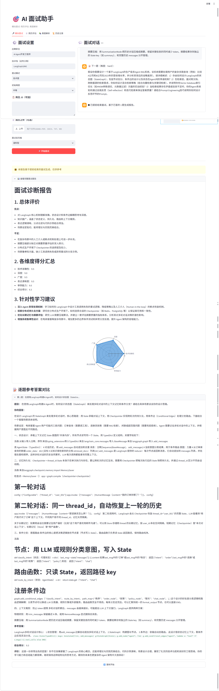
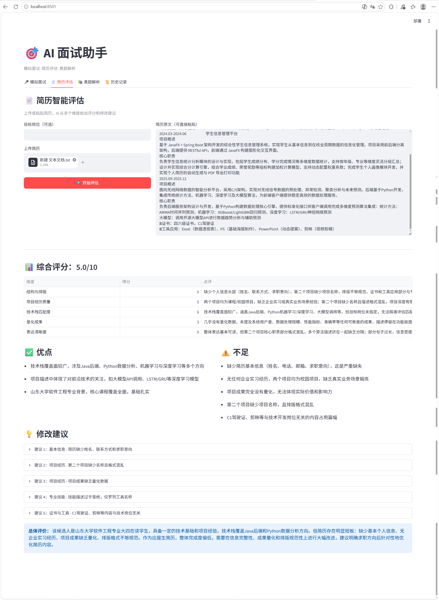
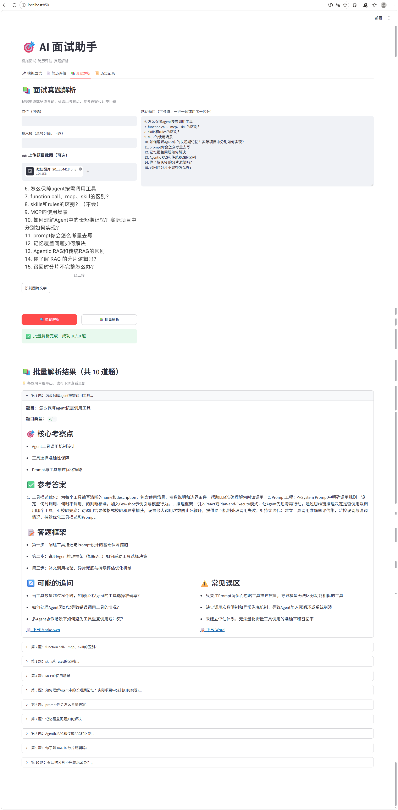
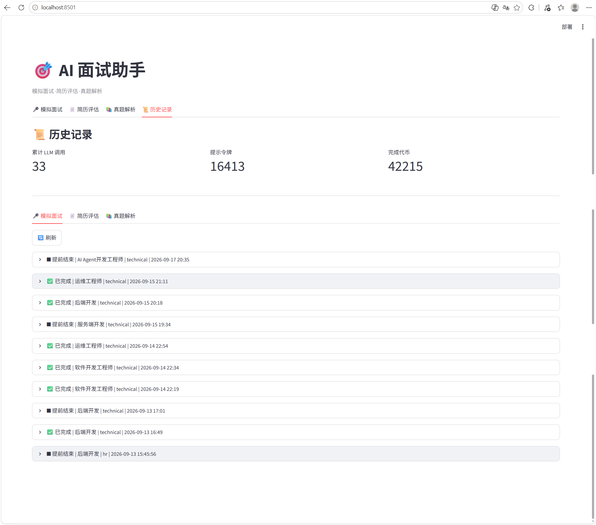

# 🎯 AI 面试工作台

> 基于 LangGraph + Qwen 的多功能 AI 面试模拟与诊断平台

[](https://www.python.org/)
[](https://fastapi.tiangolo.com/)
[](https://streamlit.io/)
[](https://github.com/langchain-ai/langgraph)
[](LICENSE)

🔗 **在线体验**：[https://zestful-commitment-production.up.railway.app]

> ⚠️ 提示：Railway 免费版服务闲置后会休眠，首次访问可能需要等待 10-30 秒冷启动。
> >  若无法访问，可能是校园网/公司网络限制，请尝试手机流量或更换网络。

---

## 📖 项目介绍

一个面向技术求职者的 AI 面试工作台，覆盖 **模拟面试、简历评估、真题解析、历史记录** 四大模块。

项目使用 **LangGraph** 编排多 Agent 协作流程，集成 **RAG 检索增强生成**（基于 SophNet Embedding + Chroma）实现知识库驱动的出题与评估，并支持 **Qwen3-VL 视觉模型** 识别面试题截图。

---

## ✨ 核心功能

### 🎤 模拟面试

- **四种面试模式**：技术面 / 行为面 / 系统设计面 / HR 面
- **四种面试官人设**：严厉型 / 温和型 / 追问型 / 沉默型
- **三种初始难度**：简单 / 中等 / 困难
- **动态追问**：基于回答完整性自动判断是否追问
- **难度自适应**：根据上一题得分动态调整下一题难度
- **结构化评分**：多维度打分 + 能力雷达图 + 参考答案对比
- **提前结束**：支持中途结束并基于已答题生成报告

### 📄 简历评估

- 支持 PDF / TXT / MD 多种格式上传
- **多维度打分**：结构与排版、项目经历质量、技术栈匹配度、量化成果、表达清晰度
- **逐条修改建议**：包含问题定位、修改方向、示例改写
- 解决 LLM 时间感知缺失问题（注入当前日期）

### 📚 真题解析

- **单题解析**：考察点、参考答案、答题框架、延伸追问、常见误区
- **批量解析**：一次粘贴多道题，自动切分逐题解析
- **图片识别**：基于 Qwen3-VL 的面试题截图 OCR
- **多格式导出**：支持 Markdown / Word 导出

### 📜 历史记录

- 三类记录持久化：面试会话 / 简历评估 / 真题解析
- 支持查看详情与删除
- 顶部展示累计 Token 消耗统计

### 🔍 RAG 增强

- **实时索引**：每道题的 Q&A 生成后立即向量化入库
- **检索增强**：出题时检索历史面试题作为上下文参考
- **内容去重**：基于文本 hash 避免重复索引
- **优雅降级**：知识库不可用时自动退化为纯 LLM 出题

---

## 🛠 技术栈

| 层级 | 技术 |
|------|------|
| 后端框架 | FastAPI + Uvicorn |
| AI 编排 | LangGraph（状态机管理多 Agent） |
| 大语言模型 | Qwen3.7-Max（SophNet 平台） |
| 视觉模型 | Qwen3-VL-Plus（图片识别） |
| Embedding | SophNet text-embeddings |
| 向量库 | Chroma（本地持久化） |
| 关系数据库 | SQLite |
| 前端框架 | Streamlit |
| 图表 | Plotly |
| 文件解析 | pdfplumber / python-docx / docx2python |
| 部署 | Railway |

---

## 📸 功能截图

### 模拟面试



### 简历评估



### 真题解析



### 历史记录




---

## 🚀 快速开始

### 环境要求

- Python 3.12+
- Git

### 本地运行

```bash
# 1. 克隆项目
git clone https://github.com/meiyiyeyy/ai-interview-assistant.git
cd ai-interview-assistant

# 2. 创建虚拟环境
python -m venv .venv

# Windows
.venv\Scripts\activate

# macOS / Linux
source .venv/bin/activate

# 3. 安装后端依赖
pip install -r backend/requirements.txt

# 4. 安装前端依赖
pip install -r frontend/requirements.txt

# 配置环境变量

在 `backend/` 目录下创建 `.env` 文件：

```env
SOPHNET_API_KEY=你的SophNet密钥
```

⚠️ 请勿将 `.env` 文件提交到 Git。

---

## 启动服务

```bash
# 终端 1 - 启动后端
cd backend
uvicorn app.main:app --reload --port 8000

# 终端 2 - 启动前端
cd frontend
streamlit run app.py
```

访问 `http://localhost:8501` 即可使用。

---

## 📁 项目结构

```text
ai-interview-assistant/
├── backend/
│   ├── app/
│   │   ├── main.py                # FastAPI 入口
│   │   ├── graph/                 # LangGraph 工作流
│   │   │   ├── state.py           # 状态定义
│   │   │   ├── nodes.py           # 节点逻辑
│   │   │   └── workflow.py        # 工作流编排
│   │   ├── models/
│   │   │   └── schemas.py         # Pydantic 模型
│   │   ├── services/
│   │   │   ├── llm_service.py     # LLM 调用封装
│   │   │   ├── rag_service.py     # RAG 检索与索引
│   │   │   ├── export_service.py  # 导出服务
│   │   │   └── file_parser.py     # 文件解析
│   │   └── storage/
│   │       └── session_store.py   # SQLite 持久化
│   ├── requirements.txt
│   └── Procfile
├── frontend/
│   ├── app.py                     # Streamlit 前端
│   └── requirements.txt
├── tests/                         # 单元测试
│   ├── test_json_parser.py
│   └── test_session_store.py
├── chroma_db/                     # 向量库（运行时生成）
├── sessions.db                    # SQLite 数据库（运行时生成）
└── README.md
```

---

## 🧪 运行测试

```bash
pytest tests/ -v
```

覆盖 JSON 解析容错、SQLite 持久化 等核心链路，共 12 个测试用例。

---

## 🌐 部署

项目已部署到 Railway，采用前后端分离的双服务架构：

| 服务 | 说明 |
| --- | --- |
| 后端 | FastAPI + Uvicorn，监听 `$PORT` |
| 前端 | Streamlit，通过 `API_BASE` 环境变量连接后端 |

### 部署关键配置

**后端服务：**

- Root Directory: `backend`
- Start Command: `uvicorn app.main:app --host 0.0.0.0 --port $PORT`
- 环境变量：`SOPHNET_API_KEY`

**前端服务：**

- Root Directory: `frontend`
- Start Command: `streamlit run app.py --server.port $PORT --server.address 0.0.0.0`
- 环境变量：`API_BASE=ai-interview-assistant-production-e5d6.up.railway.app`

---

## 💡 技术亮点

### 1. 多 Agent 协作

使用 LangGraph 状态机管理出题、评估、报告三节点协作流程，支持动态追问与条件分支。

### 2. RAG 检索增强

- **实时增量索引**：每道题生成后立即向量化入库
- **内容 hash 去重**：避免重复索引
- **优雅降级**：知识库不可用时自动退化为纯 LLM

### 3. LLM 调用健壮化

- **自动重试**：网络类异常自动重试 3 次
- **超时控制**：单次调用 60 秒超时
- **Token 统计**：实时展示累计消耗

### 4. JSON 解析多层容错

针对 LLM 返回格式不稳定的问题，设计三层容错：

1. **Markdown 包裹剥离**：处理 ` ```json ... ``` `
2. **控制字符转义**：处理字符串内真实换行
3. **正则兜底**：解析失败时提取关键字段

### 5. 时间感知修复

LLM 训练数据有截止日期，无法判断“当前时间”。通过注入系统日期解决简历时间误判问题。

---

## 📄 开源协议

本项目基于 MIT License 开源。

---

## 📬 联系方式

- GitHub: [@meiyiyeyy](https://github.com/meiyiyeyy)
- Gitee: [@each-page](https://gitee.com/each-page)

---

## 🙏 致谢

- [LangGraph](https://github.com/langchain-ai/langgraph) - Agent 工作流编排
- [Qwen](https://github.com/QwenLM/Qwen) - 大语言模型与视觉模型
- [FastAPI](https://fastapi.tiangolo.com/) - 后端框架
- [Streamlit](https://streamlit.io/) - 前端框架
- [Chroma](https://www.trychroma.com/) - 向量数据库
- [Railway](https://railway.app/) - 云部署平台
